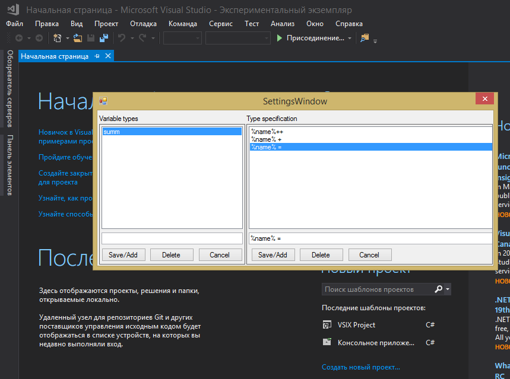
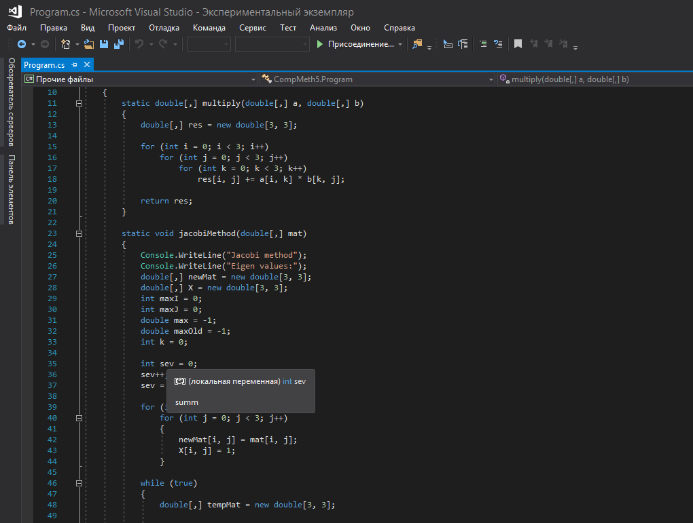

# SecondYearPaper

SPbU second bachelor year study paper

Microsoft Visual Studio 2017 variable categories founder extension.

## What is it capable of?

This extension is aimed to found and mark variable categories in code editor of Microsoft Visual Studio 2017.

You can add some named variables categories specifications, so variables that fall in this categories will be marked in IntelliSense
tooltips as variables of that category.

## How to use the extension?

After installing the extension open Visual Studio. Via menu in Tools > Manage types specifications you can add type categories and their specifications.

For each category you can add multiple specifications. All specifications are like _%name%_, where %name% is neccessary part of each specification and will
be replaced with variable during code analyzing. Instead of \* you can add any desirable text.

Variables that match all specifications for category are considered as falling into this category.
If variable is within some category, its name will be shown in IntelliSense tooltip of variable.

## How to build the extension?

The extension is written using .NET Framework 4.6.

After downloading:

- Open solution in Visual Studio 2017;
- Restore NuGet packages;
- Build the solution;
- In bin output directory you will find .vsix file. This is installable extension file.
